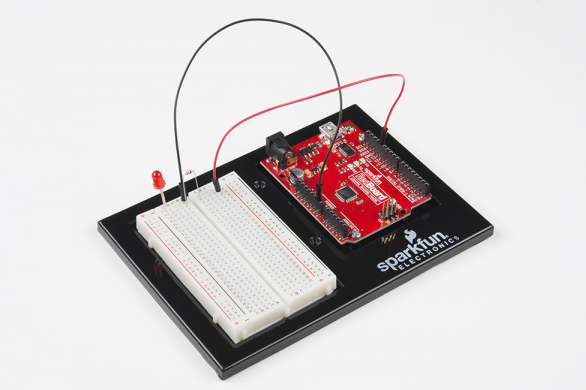

# ArduinoCode
[ArduinoCodeLink](https://create.arduino.cc/editor/moistbiscuit/05fa337a-3d5a-4a3b-97ad-c935780235e6/preview)

I forgot how to create a link so I used this to help me [ReadMe link code](https://www.quora.com/How-do-I-create-a-hyperlink-in-the-README-file-in-my-GitHub-account-which-would-redirect-to-a-new-page-containing-the-project-explanation)
I had some difficulties getting my board recognized and had to download the arduino app, even then it wouldn't let my upload the code to my board on either pin.

I also didn't remember how to make a throwaway folder for images so I uploaded the image and looked at my old code and tried the file name in the code and it worked.
